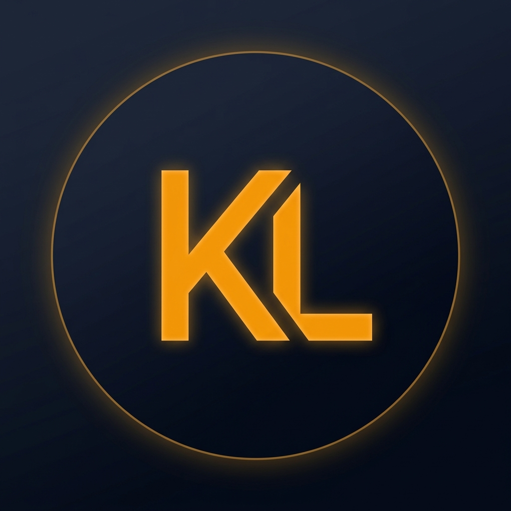

# 💎 Krishan Lal | Full-Stack Developer

A high-end, editorial-style developer portfolio built for the modern web. This project features a bespoke design system, fluid motion components, and a dual-mode theme engine designed for high-performance interaction.

 

## 🚀 Core Technologies

- **Frontend:** React 19 + Vite
- **Animations:** Framer Motion (Physics-based curves)
- **Styling:** Vanilla CSS + Tailwind CSS (Utility-first flexibility)
- **Icons:** Lucide React
- **Services:** EmailJS (Contact form automation)

## ✨ Key Features

- **🌓 Dynamic Theme Engine:** Seamless transition between "Obsidian Dark" and "Iridescent Light" modes using high-performance CSS variables.
- **📱 Hybrid Navigation:** A minimalist floating dock for desktop and a thumb-friendly bottom dock for mobile users.
- **🧊 Interactive Components:**
    - **Code Terminal Hero:** A typing-animated IDE terminal replacing traditional static images.
    - **Sticky Stack Cards:** Experience and Projects stack elegantly during scroll using sticky positioning.
    - **Reveal Animations:** Staggered intersection observer reveal effects on every section.
- **⚡ Performance Optimized:** Zero-lag scrolling achieved via IntersectionObserver and optimized state management.
- **📄 Dossier Integration:** Direct-to-download CV system with custom file-naming attributes.

## 🛠️ Local Setup

1. **Clone the repository**
   ```bash
   git clone https://github.com/krishan-developer-portfolio.git
   ```

2. **Install dependencies**
   ```bash
   npm install
   ```

3. **Configure Environment Variables**
   Create a `.env` file in the root directory:
   ```env
   VITE_EMAILJS_SERVICE_ID=your_service_id
   VITE_EMAILJS_TEMPLATE_ID=your_template_id
   VITE_EMAILJS_PUBLIC_KEY=your_public_key
   ```

4. **Run Development Server**
   ```bash
   npm run dev
   ```

## 📂 Project Structure

- `/src/components`: Modular, reusable React components.
- `/src/context`: Global state management for theme and UI hooks.
- `/src/index.css`: Global design system and variable definitions.
- `/public`: Static assets including the project dossier (CV).

---

Designed with ❤️ for premium web experiences.